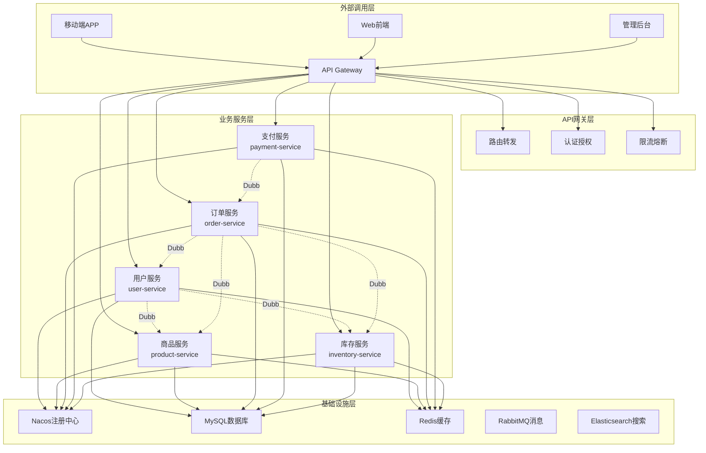

# Mall微服务平台 API文档中心

## 项目简介

Mall微服务平台是一个基于Spring Cloud + Dubbo的电商微服务解决方案，采用领域驱动设计(DDD)，提供完整的电商业务功能。

## 技术架构

- **微服务框架**: Spring Cloud Alibaba
- **RPC框架**: Apache Dubbo
- **注册中心**: Nacos
- **配置中心**: Nacos Config
- **API网关**: Spring Cloud Gateway
- **数据库**: MySQL 8.0
- **缓存**: Redis 7.0
- **消息队列**: RabbitMQ
- **搜索引擎**: Elasticsearch

## API文档导航

### 🚀 Dubbo内部服务API

| 服务模块 | 文档链接 | 服务功能 | 状态 |
|---------|---------|---------|------|
| 用户服务 | [user-dubbo-api.md](./user-dubbo-api.md) | 用户管理、地址管理、会员服务 | ✅ |
| 商品服务 | [product-dubbo-api.md](./product-dubbo-api.md) | 商品管理、分类管理、品牌管理 | ✅ |
| 库存服务 | [inventory-dubbo-api.md](./inventory-dubbo-api.md) | 库存管理、仓库管理、库存查询 | ✅ |
| 订单服务 | [order-api.md](./order-api.md) | 订单管理、购物车、退款处理 | 📝 |
| 支付服务 | [payment-api.md](./payment-api.md) | 支付处理、退款管理、账单查询 | 📝 |

### 📊 Dubbo服务总览

- **[Dubbo API总览](./dubbo-api-总览.md)** - 所有Dubbo服务接口汇总

### 🌐 HTTP REST API

| 服务模块 | 文档链接 | 服务功能 | 状态 |
|---------|---------|---------|------|
| 用户服务 | [user-api.md](./user-api.md) | 用户相关HTTP接口 | 📝 |
| 商品服务 | [product-api.md](./product-api.md) | 商品相关HTTP接口 | 📝 |
| 订单服务 | [order-api.md](./order-api.md) | 订单相关HTTP接口 | 📝 |
| 支付服务 | [payment-api.md](./payment-api.md) | 支付相关HTTP接口 | 📝 |

## 服务架构图



## 快速开始

### 环境要求

- JDK 17+
- Maven 3.8+
- MySQL 8.0+
- Redis 7.0+
- RabbitMQ 3.12+
- Elasticsearch 8.11+
- Nacos 2.4+

### 本地开发

1. **启动基础服务**
```bash
# 使用Docker Compose启动基础设施
docker-compose -f docs/tempconfig/docker-compose-nacos.yml up -d
```

2. **配置Nacos**
```bash
# 访问Nacos控制台
http://localhost:8848/nacos
# 默认账号密码: nacos/nacos
```

3. **启动微服务**
```bash
# 按顺序启动各个服务
cd mall-service/user-service && mvn spring-boot:run
cd mall-service/product-service && mvn spring-boot:run
cd mall-service/inventory-service && mvn spring-boot:run
cd mall-service/order-service && mvn spring-boot:run
cd mall-service/payment-service && mvn spring-boot:run
cd mall-gateway && mvn spring-boot:run
```

### API调用示例

#### Dubbo服务调用
```java
@Service
public class OrderServiceImpl {
    
    @Reference
    private UserDubboService userDubboService;
    
    @Reference
    private ProductDubboService productDubboService;
    
    @Reference
    private InventoryDubboService inventoryDubboService;
    
    public void createOrder(OrderCreateRequest request) {
        // 获取用户信息
        Result<UserVO> userResult = userDubboService.getUserById(request.getUserId());
        
        // 获取商品信息
        Result<List<SkuVO>> skuResult = productDubboService.getSkusByIds(request.getSkuIds());
        
        // 锁定库存
        List<StockLockRequest> lockRequests = buildLockRequests(request);
        Result<List<StockLockVO>> lockResult = inventoryDubboService.batchLockStock(lockRequests);
        
        // 创建订单...
    }
}
```

#### HTTP API调用
```bash
# 用户注册
curl -X POST http://localhost:8080/api/user/register \
  -H "Content-Type: application/json" \
  -d '{
    "username": "testuser",
    "password": "123456",
    "phone": "13800138000"
  }'

# 商品查询
curl -X GET "http://localhost:8080/api/product/spu/list?pageNum=1&pageSize=20"

# 创建订单
curl -X POST http://localhost:8080/api/order/create \
  -H "Content-Type: application/json" \
  -H "Authorization: Bearer YOUR_TOKEN" \
  -d '{
    "addressId": 1,
    "items": [
      {"skuId": 1, "quantity": 2}
    ]
  }'
```

## 开发规范

### API设计规范

1. **统一响应格式**
```java
{
    "code": 200,
    "message": "操作成功", 
    "data": {},
    "timestamp": "2024-01-01T12:00:00"
}
```

2. **错误码规范**
- 10xxx: 用户服务错误
- 20xxx: 商品服务错误
- 30xxx: 库存服务错误
- 40xxx: 订单服务错误
- 50xxx: 支付服务错误

3. **命名规范**
- 类名: PascalCase (UserService)
- 方法名: camelCase (getUserById)
- 常量: UPPER_SNAKE_CASE (USER_STATUS_ACTIVE)
- 包名: lowercase (com.mall.user.service)

### 版本管理

- API版本号格式: v{major}.{minor}.{patch}
- 当前版本: v1.0.0
- 向后兼容原则
- 重大变更需要升级主版本号

## 监控运维

### 服务监控

- **Dubbo Admin**: http://localhost:8080/dubbo-admin
- **Nacos控制台**: http://localhost:8848/nacos
- **Sentinel控制台**: http://localhost:8858
- **Zipkin链路追踪**: http://localhost:9411
- **Prometheus监控**: http://localhost:9090
- **Grafana面板**: http://localhost:3000

### 日志管理

```yaml
# logback-spring.xml配置
<configuration>
    <appender name="STDOUT" class="ch.qos.logback.core.ConsoleAppender">
        <encoder>
            <pattern>%d{yyyy-MM-dd HH:mm:ss.SSS} [%thread] %-5level [%X{traceId}] %logger{36} - %msg%n</pattern>
        </encoder>
    </appender>
    
    <appender name="FILE" class="ch.qos.logback.core.rolling.RollingFileAppender">
        <file>logs/application.log</file>
        <rollingPolicy class="ch.qos.logback.core.rolling.SizeAndTimeBasedRollingPolicy">
            <fileNamePattern>logs/application.%d{yyyy-MM-dd}.%i.log</fileNamePattern>
            <maxFileSize>100MB</maxFileSize>
            <maxHistory>30</maxHistory>
        </rollingPolicy>
        <encoder>
            <pattern>%d{yyyy-MM-dd HH:mm:ss.SSS} [%thread] %-5level [%X{traceId}] %logger{36} - %msg%n</pattern>
        </encoder>
    </appender>
    
    <root level="INFO">
        <appender-ref ref="STDOUT"/>
        <appender-ref ref="FILE"/>
    </root>
</configuration>
```

## 常见问题

### Q: 如何解决Dubbo服务启动失败?
A: 检查Nacos注册中心是否正常运行，确认网络连接和配置文件。

### Q: 接口调用超时怎么办?
A: 检查服务提供者是否正常，适当调整超时时间配置。

### Q: 如何进行服务降级?
A: 使用Sentinel配置熔断规则，实现fallback方法。

### Q: 数据库连接池满了怎么办?
A: 检查慢SQL，优化数据库查询，调整连接池配置。

## 贡献指南

1. Fork项目到个人仓库
2. 创建功能分支 (`git checkout -b feature/amazing-feature`)
3. 提交更改 (`git commit -m 'Add some amazing feature'`)
4. 推送到分支 (`git push origin feature/amazing-feature`)
5. 开启Pull Request

## 技术支持

- 📧 邮箱: support@mall.com
- 💬 微信群: Mall技术交流群
- 📖 Wiki: [项目Wiki](https://github.com/mall/wiki)
- 🐛 问题反馈: [GitHub Issues](https://github.com/mall/issues)

---

**📝 文档状态说明:**
- ✅ 已完成
- 📝 待完善
- 🔄 更新中
- ❌ 已废弃 